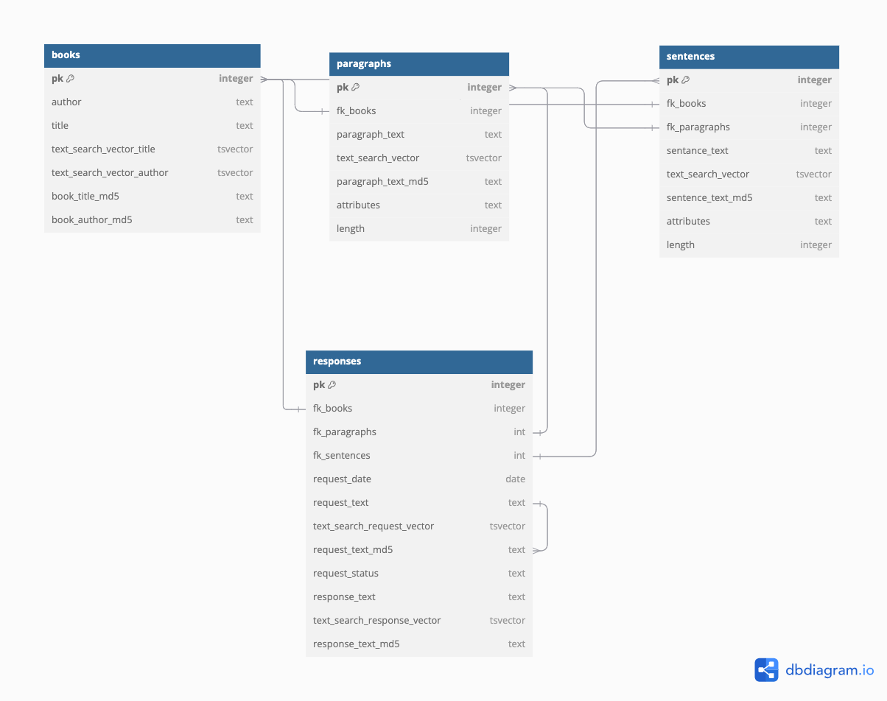

# la-recherche-des-mots-perdus

App to help prevent those awkward moments when you can't find the quote you are looking for (UI/API to come ...).

## Background 

There is an absence of reliable services for finding direct quotes from books using a search prompt. goodreads provides a similar service, however its queries are restricted to user-uploaded quotes and does not allow for prompt based searching within a particular book. LLMs often generate quotes that resemble the style and tone of the desired author or book, but hallucination is common. This phenomenon is primarily due to the training and generation mechanisms of LLMs. During training, contextual embeddings and transformer architectures abstract quotes away from their literal text, focusing instead on patterns and associations within the broader training data. Quotes are not treated as singular, indivisible tokens; rather, the model learns to predict subsequent tokens (within a quote) probabilistically based on context. As a result, when generating responses, LLMs prioritize coherence and contextual relevance over factual accuracy, often leading to hallucinations.

**La recherche des mots perdus** hopes to provider a service that leverages advancements of NLP, while ensuring integrity of responses and providing a lightweight solution. This is accomplished through two primary features:

* Insertion of new book into list of queryable books
* Prompt-based search for quotes within existing books

## New book insertion 

### Insertion into DB

Before insertion, a fuzzy match is conducted on existing book/author combinations in the DB to ensure the book has not already been inserted. 

If the book does not exist, there are two means for a user to insert a new book: prompting the system to scrape the book or uploading a .txt file of the book. 

To prompt the system to scrape the book, a user specifies the book's title and author. The system then proceeds to search [The Gutenberg Project](https://www.gutenberg.org/) for the desired book. After confirming the correct book was found, the system proceeds to scrape the text within chapters of the book. 

If the book is unable to be found on Gutenberg, the user has the option to upload a .txt file of the full text. *** to add, more functionality for determining where the book starts and ends within the text file/within gutenberg (although gutenberg is more predictable)

Once the full book text is acquired, some basic cleaning is applied and paragraphs/sentences are inserted into the DB. *** the DB is currently a local postgres server, but eventually will be replaced with AWS RDS. The model for the DB is as follows: 

Upon successfully scraping the book text or reading the text file, a new record is inserted into the `books` table with the title and author. Each paragraph and sentence is inserted into the paragraphs and sentences tables, respectively.   

### Embedding with Word2Vec

Per Mikolov et al. (2013), a Skip-gram model is implemented to learn embeddings for each word in the book text corpus. The model is trained using sentences from the book text as examples, with a fixed window size adjusted based off size of the vocabulary and corpus of the particular book. To reduce complexity, negative sampling is used, where random words which do not appear in the context window are drawn and the objective becomes a binary classification problem of between positive and negative samples. The objective becomes maximizing the log likelihood of positive samples being classified as positive samples and negative samples being classified as negative samples. Related probabilities include P(y=1 | target word, positive sample context word) which is defined as sigmoid(target word' positive sample context word) and P(y=0 | target word, negative sample context word) defined as 1- sigmoid(target word' negative sample context word). Since the goal of this model is to learn embeddings rather than produce a full probability distribution over the vocabulary, negative sampling offers a computationally efficient way to train high-quality contextual representations by avoiding expensive full-softmax calculations.

After word embeddings are learned, sentence embeddings are formed through computing weighted averages of words within each sentence. TF-IDF weights are used in the weighted average. Treating each sentence as a document, the tf-idf for a given word were computed as (word frequency in sentence) * (1 +log( Number of sentences/(number of sentences where word appears))), thus reducing contributions of words appearing in many sentences and prioritizing frequent words within a sentence in the sentence embedding computation and adjusting for sentence length. 

### Clustering

Clustering provides an effective means of reducing the number of similarity computations needed for input text. By training only when a new book is uploaded clustering models provide a big benefit for some up front costs. Clustering models can predict the clusters that the input text aligns most closely with. With this clustering information, similarity calculations are then limited to sentences that belong to the same or similar clusters, thus improving efficiency.

The context presents two key factors in deciding a method for clustering the sentence embeddings:

* Triggered by user input, the number of cluster must be non-parametric (i.e. the optimal number of clusters must be determined from the data)
* Due to the dimensionality and nature of sentence embeddings assumptions of cluster shape and discrete clusters are invalid.

For these reasons a gaussian mixture model with Dirichlet conjugate priors is used ('Hierarchical Dirichlet Processes', Teh et al.). Through a Dirichlet process a prior random distribution over the mixture weights is created. Serving as a distribution over the weights of the gaussian distributions the prior allows for initializing the model with, theoretically infinite, number of mixture weights (clusters) which when taking observed data into account are adjusted in the posterior distribution to an optimal number weights and weight magnitudes. The key parameter in the Dirichlet process is a concentration parameter, gamma, and assumed distribution of mixture weights. By definition, the mixture weights sum to 1 and are >= 0, so this underlying distribution is defined over [0,1]. To construct the Dirichlet process random probability distribution, random samples are drawn from the underlying distribution and are assigned probability values using the stick breaking protocol. The gamma parameter implicates the stick breaking protocol, as smaller gammas lead to few mixture weights with large values and larger gammas lead to more mixture weights with small values. In this context, gamma is set to a relatively large value to encourage many topic clusters, particularly in longer novels. Gaussian mixture models serve as a good clustering method as they allow for overlap and provide the probability densities for each cluster. The GMM is fit by maximizing the expected likelihood of the joint probability of the data for each Gaussian with a lagrangian to ensure mixture weights sum to 1.  

## Prompt handling and response

### Embedding the prompt 

Once a book has been inserted into the DB, embedded, and clustered a user is able to search for desired quotes through sending prompts to the system. In order to operate on the user's prompt, the prompt must be embedded. This is done using the same model that produced embeddings for words in the book. One difficulty which arises is if the user's prompt contains a word that was not in the vocabulary of the book (and hence the vocabulary the model was trained on). This can happen due to typos in the user's prompt or the response genuinely containing new words. Out of vocab words (OOV) are handled in this way:

* First, the prompt is parsed and split in to tokens. Proper nouns are removed from the following steps.
* If a token is identified as being spelled wrong, the token is spell corrected using a simple spell correction algorithm. The algorithm works by identifying the most probable word given the least amount of character corrections. "Probable" in this context is frequentist and merely comes from word frequencies in a large corpus of texts and terms. Character corrections include deletions, transposes (switching the position of two characters), replaces, and inserts. 
* Once spell corrected, the first step is to attempt to find a potential match in the book vocabulary. This is done using Levenshtein distance, with a high threshold. In theory, if the token in the prompt was intended to be a token in the vocabulary (and we assume it takes the fewest character corrections to arrive at it), after the initial spell correcting, we would expect the token to be within one character edit of the word in the vocabulary. Therefore, the threshold is set high to ensure we aren't matching in places where we shouldn't.
* If a fuzzy match fails, synonyms are searched for the input token. If synonyms which appear in the book are vocabulary are identified, context for the synonym are compared to the context of the input token. If only one synonym is identified or no context words match for the synonyms and the input token, we proceed to the next logic. Otherwise, the best synonym is identified by looking at synonyms with the highest number of distinct context words appearing in the window of one sentence across the entire book. Ties are broken first by the number of distinct context words appearing in the window across all sentences, then the total number of sentences with at least one context word appearing in the window. 
* If the criteria for synonym matching is not met, a list of potential matches is generated through looking at tokens in the text that appear with the same context words as the input token. Using a similar scoring logic as above, optimal replacement tokens are identified by looking at replacement tokens with the highest number of distinct context words appearing in the window of one sentence across the entire book (i.e. multiple context words within the same window of the same sentence). Ties are broken first by the number of distinct context words appearing in the window across all sentences, then the total number of sentences with at least one context word appearing in the window. 
* If no matches are found after the above steps, the token is excluded from the mean over the word embeddings to create the prompt embedding. With a large corpus this is unlikely, since it implies that both the input token and all context tokens did not appear in the book's text. 

After token embeddings are determined, the prompt is embedded as the mean across the word embeddings. A potential enhancement would be to include IDF weights to these sentences, weighting words which appeared in fewer documents higher than those which appeared in many. This may produced a more distinguishable vector embedding of the prompt, relative to a simple mean.

### Clustering and computing similarity 

Once embeddings are produced, the prompt is clustered using the trained Gaussian Mixture Model. Since the model enables the prediction of probability densities for each Gaussian cluster, the most probable clusters are retained (based off a probability threshold), and are treated as the potential clusters the prompt belongs to. 

Having a list of probable clusters the prompt belongs to enables us to reduce the potential response space to sentences from the book that are also probable to belong to the same clusters. Assuming cluster size grows as the number of sentences grows, this would reduce the complexity from O(N) to O(N/K). Furthermore, if we model the number of clusters in relation to corpus size as K = N^(beta) where beta is in (0, 1] (for instance a square root growth where, when small, changes to the size of the corpus induce relatively larger changes in the number clusters), the complexity reduces to O(N^1-Beta). 

After determining the list of sentences in the same cluster as the prompt, cosine similarities are computed to rank sentences based off similarity to the prompt. 

### Responding 

In descending fashion, relative to cosine similarity scores, the original sentence text from the book is retrieved and displayed in the UI. User's will have an option to request more quotes, which will present additional quotes until a certain similarity score threshold is met or all sentences within the match clusters are exhausted. Users will also have the option of indicating if the quote they had in mind was identified. 

On the backend, the original prompt text and responses are stored in the `reponses` table with associated similarity scores and keys to link to the original text. If a user identified this quote as being the quote they had in mind, the request status will indicate that this response was accepted. The `reponses` table will serve as a helpful look up in cases when the same or similar prompt was asked by a user, and can reduce the need for additional similarity computations. 

## Future enhancements
1. UI development
2. Common component removal from sentence embeddings using PCA. Results in more differentiated vectors. 
3. Weighting of tokens in prompt when producing prompt embedding
4. As `responses` table grows, train a model with this as a corpus and add it as a final layer to sort the potential responses based off cosine scores, sentence/prompt embeddings, and the `request_status` label

## License

This project is licensed under the MIT License - see the [LICENSE](LICENSE) file for details.
